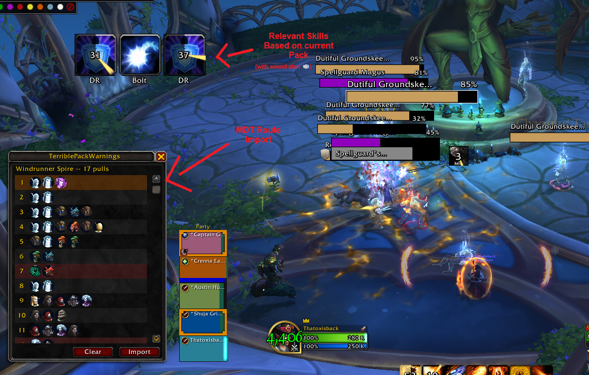

# TerriblePackWarnings

A WoW Midnight addon that shows ability warnings for dungeon trash packs
in Mythic+. Import an MDT route, configure which skills to track, and
get spell icons with countdown timers and cast detection highlights when
you pull tracked packs.

Midnight's addon API is heavily restricted -- no combat log, spell IDs
from casts are secret values, health values are hidden. The addon
works around these limitations with nameplate scanning and timer-based
predictions. The result is **Terrible** at best, but if you think it's
better than nothing, feel free to use this as you see fit.

This addon is in **early stages of development**. Profiles and
configuration formats may change between updates and are not guaranteed
to be backwards compatible until a stable version is reached.

## AI Usage

This addon was built with the help of [Claude AI](https://claude.ai/).
I'm an experienced Software Developer but very new to Blizzard's API
and game addon/modding development. Claude assisted with learning the
WoW addon API and writing the implementation. The addon is maintained by
me to the best of my abilities.

## Showcase

## Features

- **Mob category tagging** -- every mob is categorized as boss, miniboss,
  caster, warrior, rogue, or trivial with color-coded tags in the config
  window. Categories are detected at runtime and used to filter which
  abilities trigger alerts. Unknown mobs are treated as wildcards so you
  never miss a warning.
- **Per-skill configuration** -- choose which abilities to track per mob,
  set custom labels, timers, and sound/TTS alerts
- **Timed ability warnings** -- spell icons with cooldown sweep countdown
  for abilities with known cast timers
- **Cast detection and alerts** -- untimed skill icons glow orange when
  a mob of the matching category starts casting, with optional sound or
  TTS alerts on cast detection
- **MDT route import** -- paste an MDT/Keystone.guru export string to load
  your route with per-dungeon storage
- **8 Midnight S1 dungeons** -- ability data extracted from MDT for
  Algethar Academy, Magisters' Terrace, Maisara Caverns, Nexus Point
  Xenas, Pit of Saron, Seat of the Triumvirate, Skyreach, and
  Windrunner Spire -- all mobs categorized from in-game verification

## Usage

### Auto Mode

1. Install the addon and `/reload`
2. Open config: `/tpw`
3. Browse dungeons and mobs in the left panel
4. **Check or search for the skills you want to track** for each mob
5. For skills with known timers, check **Timed** and enter the First Cast
   and Cooldown values (in seconds)
6. Enable **Sound Alert** if you want audio warnings -- best for timed
   skills or when the mob has a single dangerous cast. For untimed
   skills, sound triggers on any cast from the same class, which can
   produce false positives
7. Open route window: `/tpw route`
8. Click **Import**, paste an MDT export string
9. Set mode to **Auto**
10. Enter the dungeon and start pulling -- ability icons appear
    automatically as you engage tracked packs. Pack progression is
    inferred from entering and leaving combat.

### Manual Mode

A more flexible usage that doesn't require a strict route:

1. Import a partial route with only the mobs you want to track
2. Configure skills as above
3. Set mode to **Manual** in the route window
4. Click the pack row in the route window before or at the start of
   the fight to activate tracking for that pack
5. Timed skills show countdown sweeps, untimed skills show static icons
   that glow orange on cast detection

### Commands

| Command | Action |
|---------|--------|
| `/tpw` | Open config window |
| `/tpw config` | Open config window |
| `/tpw route` | Open route window |
| `/tpw help` | Show all commands |

## Data Status

Ability data for all 8 Midnight Season 1 dungeons has been extracted
from MythicDungeonTools. All mobs have been categorized by role (boss,
miniboss, caster, warrior, rogue, trivial) from in-game verification.
See `MobCategories.md` for the complete mob category index.

- **No abilities have pre-set timers** -- all timing data must be
  configured by the player through the profile system.
- **Ability coverage varies** -- some dungeons have more complete spell
  data than others.
- **Some mobs remain "unknown"** -- a few spawns and boss adds could
  not be verified and are tagged as unknown (treated as wildcard at
  runtime so alerts still fire).

If you have verified ability timers, contributions are greatly
appreciated.

## Known Limitations

- Nameplate scanning requires enemy nameplates to be enabled
- Cast detection cannot identify which specific spell is being cast
  (Midnight wraps spell IDs as secret values) -- it can only detect
  that a mob is casting *something*
- Mob health values are secret -- HP-based ability timing is not possible
- Untimed sound alerts trigger on any cast from a mob of the matching
  category, which can produce false positives
- Auto mode advances packs on combat end, which may not match your
  actual pull order
- Leaving a season dungeon automatically sets mode to Disable -- you
  must re-enable Auto or Manual when entering a dungeon

## Planned

- Repositioning and sizing of spell icon display through Edit Mode
- Community-contributed ability profiles with verified timers
- Additional quality-of-life UI improvements

## License

[GPL-2.0](LICENSE)
